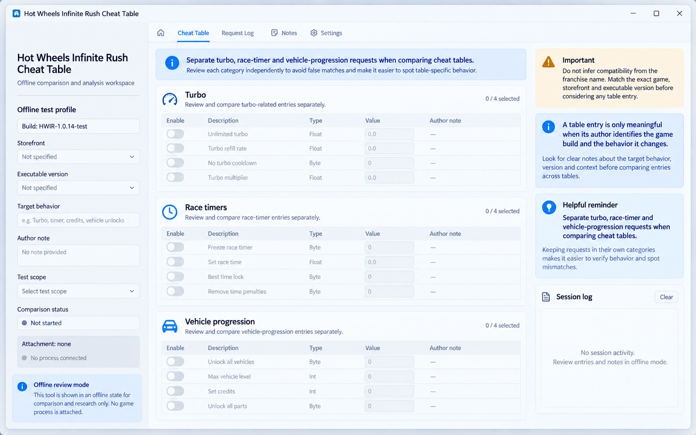

<h1 align="left">Hot Wheels Infinite Rush : Cheat Table pour Windows 🏎️</h1>

<!-- Screenshot source: AI-generated interface illustration; not an upstream screenshot | SHA256: 68c1c80933e02ae98eb2b7f31dbfd8240443df0e3665929dfdb846501d8c68b5 -->

   

Comparez les tables de triche Infinite Rush par fonction : turbo, durée de course et déblocage ne modifient pas nécessairement les mêmes données.

<strong>Sommaire</strong> <a href="#focus">Turbo · Chronomètre · Progression des véhicules</a> · <a href="#comparison">Compatibilité</a> · <a href="#questions">Questions fréquentes</a> · <a href="#alternatives">Alternatives</a> · <a href="#setup">Périmètre du dépôt</a>

<a href="README.md">English</a> · <a href="README_ES.md">Español</a> · <a href="README_PT.md">Português (Brasil)</a> · <a href="README_DE.md">Deutsch</a> · <b>Français</b> · <a href="README_CN.md">简体中文</a> · <a href="README_TW.md">繁體中文</a> · <a href="README_JP.md">日本語</a> · <a href="README_KR.md">한국어</a>

## Turbo · Chronomètre · Progression des véhicules : compatibilité et données

> Une table destinée à un autre Hot Wheels ne prouve aucune compatibilité.

---

## Hot Wheels Infinite Rush : Cheat Table — Turbo · Chronomètre · Progression des véhicules

<table><tr><td width="33%" valign="top"><strong>🔎 Turbo</strong>
Relevez version et option recherchée.
</td><td width="33%" valign="top"><strong>⚙️ Chronomètre</strong>
Comparez le comportement documenté.
</td><td width="33%" valign="top"><strong>🎯 Progression des véhicules</strong>
Observez une seule modification en gardant la sauvegarde initiale.
</td></tr></table>

---

## Questions fréquentes sur Hot Wheels Infinite Rush : Cheat Table

Progression des véhicules — Que vérifier en premier ?

Une table destinée à un autre Hot Wheels ne prouve aucune compatibilité.

---

## Hot Wheels Infinite Rush : Cheat Table : périmètre du dépôt

Ce dépôt documente Hot Wheels Infinite Rush : Cheat Table comme méthode de recherche et de compatibilité ; il ne contient aucun exécutable ni installateur. Un lien externe ne prouve ni l’identité de l’éditeur, ni la sécurité, ni la compatibilité.

1. Vérifiez l’éditeur, la page des versions et la version de Windows ou du jeu prise en charge par Hot Wheels Infinite Rush : Cheat Table.
2. Examinez l’archive de Hot Wheels Infinite Rush : Cheat Table avant extraction, analysez-la et comparez sa somme de contrôle lorsque l’éditeur en fournit une.
3. Gardez Hot Wheels Infinite Rush : Cheat Table hors ligne, modifiez une valeur à la fois et conservez les sauvegardes ou fichiers d’origine.

## Hot Wheels Infinite Rush : Cheat Table : alternatives et méthodes associées

Un trainer agit sur la session, un éditeur sur les données enregistrées. Un réglage du jeu peut proposer une autre voie. Comparez effet et mode.
